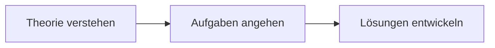

# 🚀 PHP Grundlagen Lernprojekt

## 📚 Überblick

Dieses Repository dokumentiert meinen Lernfortschritt im PHP-Grundlagenkurs. Der Kurs ist in zwei Tage aufgeteilt und kombiniert theoretische Grundlagen mit praktischen Übungen.

## 🎯 Lernkonzept

Mein Lernansatz folgt einem strukturierten 3-Stufen-Modell:

1. **Theorie**: Grundlegendes Verständnis aufbauen
2. **Aufgaben**: Praktische Herausforderungen annehmen
3. **Lösungen**: Eigenständige Implementierung

## 📋 Kursinhalte

### Tag 1
- **Begrüßung/Einführung**
  - Erste Schritte in der PHP-Welt
  - Überblick über den Kursablauf
  
- **Interaktive Website**
  - Grundlagen der Web-Interaktivität
  - Client-Server-Kommunikation
  
- **Webserver-Setup**
  - Lokale Entwicklungsumgebung
  - Server-Konfiguration
  
- **PHP-Grundlagen**
  - Syntax und Basiskonzepte
  - Variablen und Datentypen
  
- **PHP-Aufgaben**
  - Praktische Übungen
  - Code-Beispiele
  
- **Datenbankanbindung**
  - MySQL-Grundlagen
  - PHP-Database-Connectivity

### Tag 2
- **Datenverarbeitung**
  - Fortgeschrittene Datenmanipulation
  - Array-Verarbeitung
  
- **Formularvalidierung**
  - Sichere Eingabevalidierung
  - Best Practices
  
- **Paketverwaltung mit Composer**
  - Dependency Management
  - Package Installation
  
- **Web Application Security**
  - Sicherheitsgrundlagen
  - Best Practices für sichere Webanwendungen

## 🛠️ Projektstatus

- [x] Tag 1 Material gesichtet
- [ ] Tag 2 Material gesichtet
- [ ] Praktische Übungen abgeschlossen
- [ ] Eigene Projekte implementiert

## 💡 Besondere Merkmale

- Strukturierter Lernansatz
- Praxisorientierte Übungen
- Fokus auf Sicherheit
- Moderne PHP-Praktiken
- Composer Integration

## 🤝 Mitwirkung

Feedback und Verbesserungsvorschläge sind immer willkommen! Fühlt euch frei, Issues zu erstellen oder Pull Requests einzureichen.

## 📝 Lizenz

Dieses Projekt ist für Bildungszwecke bestimmt. Alle Inhalte werden unter standardmäßigen Bildungsrichtlinien bereitgestellt.

---
*Entwickelt mit 💜 und viel Kaffee ☕*
